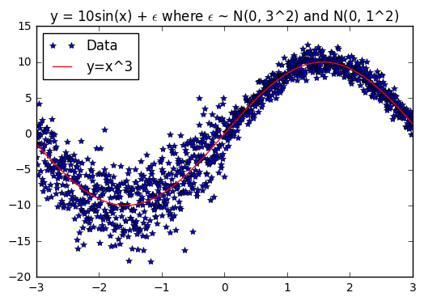
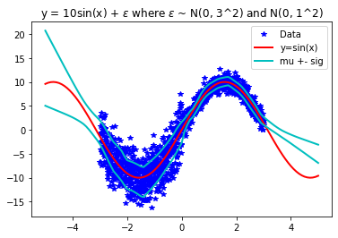
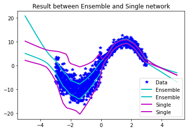
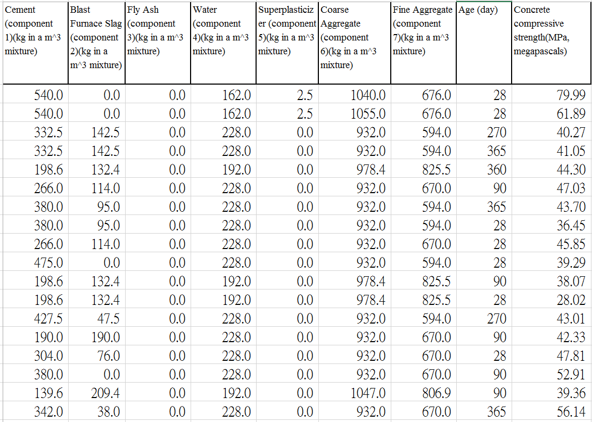
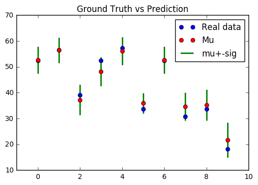
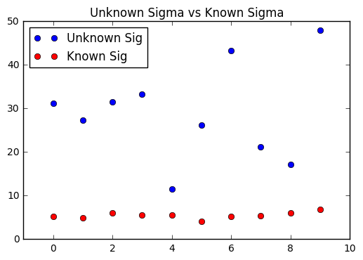
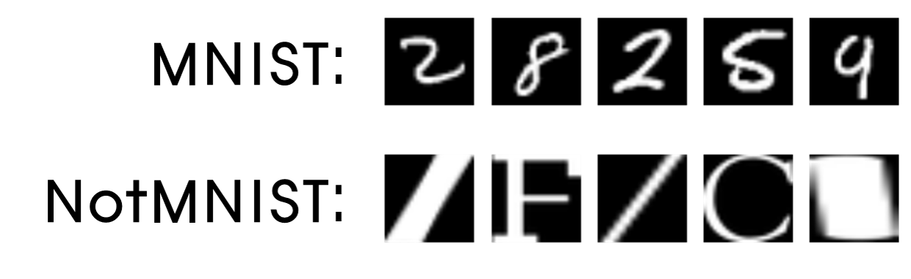
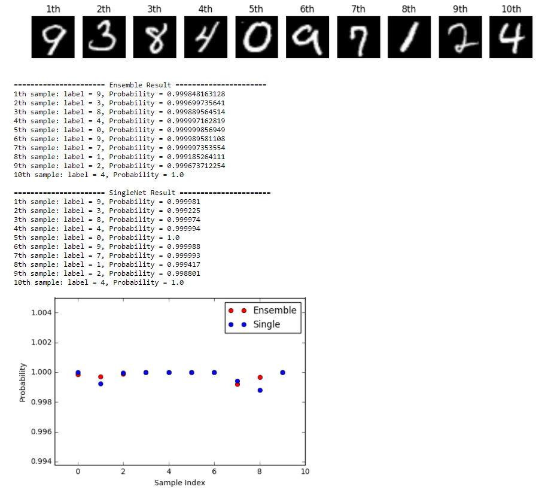
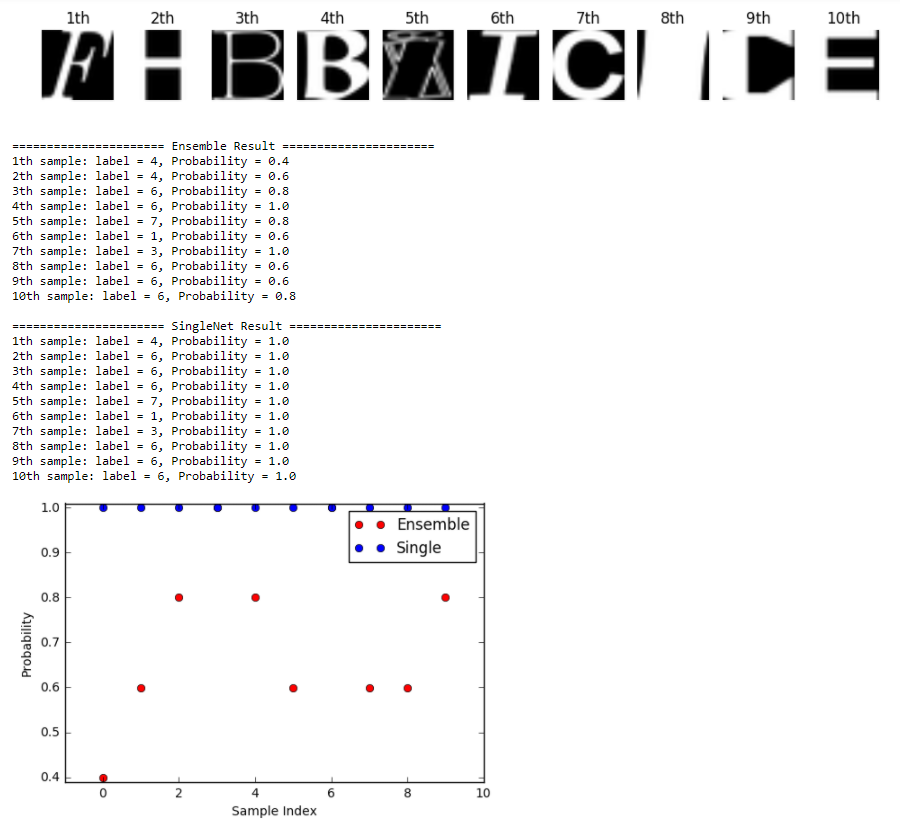

# Predictive Uncertainty Estimation using Deep Ensemble

## Introduction

This repository is for implementation of the paper [Simple and Scalable Predictive Uncertainty Estimation using Deep Ensembles](https://arxiv.org/abs/1612.01474). This algorithm quantifies predictive predictive uncertainty in non-Bayesian NN with `Deep Ensemble Model`.  

**Contribution** of this paper is that it describes `simple` and `scalable` method for `estimating predictive uncertainty estimates` from NN.

This paper uses 3 things for training

- Proper Scoring Rules
- Adversarial Training to smooth predictive distributions
- Deep Ensembles

This repository implemented without Adversarial training

The versions of deep learning libraries for this repo are as follows
- tensorflow: 2.9.1
- pytorch: 1.9.1

Implementation and Results are as follows.

## Implementation
### Regression (Toy data)
This example is result of `regression` with toy data which has simple sine data with noise.
The data for this example is as follows.

**Result of regression (toy data)** is as follows. 

The standard deviation is predicted appropriately according to the noise of the data. 
Also, the standard deviation increases for the out-of-distribution data. 

The toy data is used for evaluating result for the performance between single network and ensemble network. 
As the above graph shows, the estimation of uncertainty is poor when using a single network. 

### Regression (Real data)

This example is result of `regression` with [Concrete dataset](https://archive.ics.uci.edu/ml/datasets/Concrete+Compressive+Strength). The data which is used for this example is as follows.

It has 1030 data and it has 9 component. The `information of the components` are as follows. 

|             Name              |  Data Type   |    Measurement     |   Description   |
| :---------------------------: | :----------: | :----------------: | :-------------: |
|            Cement             | Quantitative | kg in a m3 mixture | Input Variable  |
|         Blast Furnace         | Quantitative | kg in a m3 mixture | Input Variable  |
|            Fly Ash            | Quantitative | kg in a m3 mixture | Input Variable  |
|             Water             | Quantitative | kg in a m3 mixture | Input Variable  |
|       Superplasticizer        | Quantitative | kg in a m3 mixture | Input Variable  |
|       Course Aggregate        | Quantitative | kg in a m3 mixture | Input Variable  |
|        Fine Aggregate         | Quantitative | kg in a m3 mixture | Input Variable  |
|              Age              | Quantitative |    Day (1~365)     | Input Variable  |
| Concrete Compressive Strength | Quantitative |        MPa         | Output Variable |

**Result of regression (real data)** is as follows. 

Result predicts ground truth quite well. Also, if there is difference between prediction and ground truth,  ground truth exists between the uncertainty of the prediction.

Also, I used random numbers as `unknown input` of this algorithm and compare this unknown data with known data. As you can see, standard deviation of known data is much smaller than standard deviation of unknown data.  This result shows that this algorithm is not overconfident when unknown dataset is used!:smile:

---

## Classification (MNIST)

This example is result of `classification` with famous and popular [MNIST dataset](http://yann.lecun.com/exdb/mnist/). Also, this paper used [NotMNIST Dataset](http://yaroslavvb.blogspot.kr/2011/09/notmnist-dataset.html) as unknown data. The data which is used for this example is as follows.

**Result of classification** is as follows. 

This is the `result of known data` (MNIST dataset). In this case, both ensemble and single network show good result. However, ensemble shows better performance in most case. 

This is the `result of unknown data` (NotMNIST dataset). In this case, there is big difference between ensemble network and single network. `Single network` is overconfident, even though the class of data is unknown!! However,  `Ensemble` result has lower confidence when the class is unknown!! This result shows that using ensemble for estimating predictive uncertainty is better for solving overconfident prediction problem than single network!! :clap:
